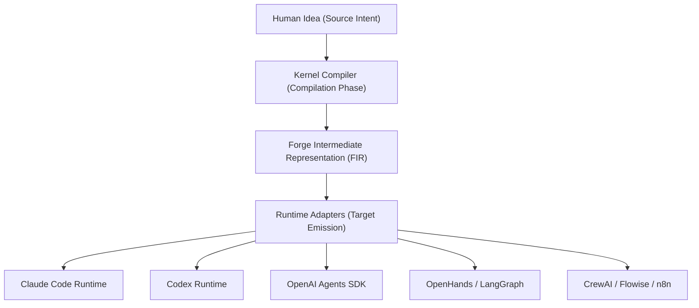

# AGENT.md — ForgeAI: The Operating System for AI Software Engineering

## 1. Project Identity & Long-Term Vision

### 1.1 Project Name & Definition
**ForgeAI** — The Operating System for AI Software Engineering.

### 1.2 The Core Vision
ForgeAI represents a paradigm shift in autonomous development systems. It is not an AI workflow generator, it is not an AI agent creator, and it is not a prompt template manager. 

**ForgeAI is an Operating System for AI Software Engineering.**

Its core responsibility is to compile a raw, high-level software idea into a complete, fully functioning AI software engineering organization. This AI organization is then compiled into multiple target execution runtimes. By treating the software organization itself as the compilation output, ForgeAI decouples the intent analysis from the target execution substrate.



### 1.3 Long-Term Vision
ForgeAI is designed to become the primary operating system orchestrating the complete lifecycle of AI-driven software development. 
In this model:
* **The Compiler is the Product**: The core system is a language compiler that interprets human intent.
* **Organizations are Outputs**: The produced binary is a structured, collaborative organization of specialized AI teams and workflows.
* **Runtimes are Targets**: Platforms like Claude Code, Codex, LangGraph, or CrewAI are treated as execution runtimes (compilation targets), similar to how x86, ARM, or WASM are compilation targets for LLVM.

---

## 2. Compiler Philosophy

ForgeAI views the generation of software systems through the lens of a compiler engineer. An unstructured human idea is treated as source code. Rather than generating application code directly in a single step, the system compiles the idea through a series of structured compiler stages.

```
Human Idea 
   ↓ (Intent Parsing)
Abstract Syntax Tree (AST) of Requirements
   ↓ (Semantic Analysis & Type Checking)
Semantic Graph of Domains and Models
   ↓ (Optimization)
Optimized Organization Graph
   ↓ (Lowering)
Forge Intermediate Representation (FIR)
   ↓ (Target Emission)
Runtime-Specific Target Code (e.g., LangGraph, CrewAI)
```

### 2.1 Compiler Mindset
1. **Unstructured to Structured**: The first task is to transform loose natural language intent into a formal Abstract Syntax Tree (AST) representing requirements, actors, domains, and data bounds.
2. **Intermediate Representation**: The system never operates on raw user inputs or goes straight to generation. All logic must compile to the intermediate state (FIR) first.
3. **Decoupled Runtimes**: The kernel is target-agnostic. The logic of compiling an organization must be completely isolated from the logic of executing that organization.

### 2.2 Compilation Stages
* **Parsing & Intent Extraction**: Analyzing input text, resolving ambiguities, and mapping them to domain entities.
* **Type Checking & Architectural Validation**: Validating that all required interfaces, endpoints, tools, and data stores have defined contracts and type signatures.
* **Optimization**: Analyzing the graph of workflows and agents to reduce token bottlenecks, cycles, and execution latency.
* **Lowering (FIR Generation)**: Serializing the optimized execution design into the Forge Intermediate Representation.
* **Code Generation / Export**: The target compiler translates the FIR schema into concrete files, modules, and commands executable by the selected runtime.

### 2.3 Source of Truth
The compiled **Forge Intermediate Representation (FIR)** is the sole source of truth for the generated organization. No runtime configuration is stored as raw prompts or individual vendor files. If an organizational workflow needs modification, the source FIR is recompiled, and target code is re-emitted.

---

## 3. Forge Intermediate Representation (FIR)

### 3.1 Definition & Purpose
The Forge Intermediate Representation (FIR) is the universal, vendor-agnostic language of ForgeAI. It represents the complete blueprint of an AI software engineering organization. FIR defines the structural, operational, and semantic parameters of the generated software organization.

### 3.2 Structure of FIR
FIR is serialized as a strict schema containing:
* **OrgSpec**: Departments, teams, agent topologies, roles, and authorization keys.
* **DomainSpec**: Datastores, business modules, service models, and entity relationships.
* **WorkflowSpec**: A Directed Acyclic Graph (DAG) specifying task steps, preconditions, parallel gates, and transition rules.
* **ToolSpec**: Function signatures, parameters (JSON Schema), credential mappings, and output formats.
* **MemorySpec**: Partitions, vector search spaces, and retrieval keys.

### 3.3 Protection of Project Data
Runtimes never receive raw codebase repositories, master credentials, or proprietary source code. The FIR abstracts these resources as sandboxed interfaces:
* Codebases are accessed through controlled, type-safe API tools.
* Secrets are referenced via variables in the FIR mapping to environment secrets in the runtime.
* This ensures that execution runtimes operate strictly inside their sandbox boundaries without leaking system data.

---

## 4. Core Mental Model

ForgeAI never thinks about isolated, single-purpose agents. It organizes tasks, roles, and execution units using a strict business organizational model.

```
Organization
    ↓
Departments
    ↓
Teams
    ↓
Agents
    ↓
Tools
    ↓
Workflows
    ↓
Runtime
    ↓
Execution
```

* **Organization**: The top-level corporate entity representing the entire software product workspace.
* **Departments**: Major cross-functional areas of responsibility (e.g., Product Management, Architecture, Engineering, Quality Assurance, Documentation).
* **Teams**: Specialized squads within a department (e.g., Frontend Team, Backend Team, Database Team).
* **Agents**: Individual autonomous actors within a team, characterized by distinct personas, system prompts, capability limits, and vector memories.
* **Tools**: Executable functions (e.g., run tests, read files, call APIs) bound to specific agents.
* **Workflows**: Ordered sets of tasks defined by dependency graphs (DAGs) routing execution steps through agents.
* **Runtime**: The execution platform hosting and supervising the agents.
* **Execution**: The live instance of a workflow operating on real-world files and systems.

---

## 5. Kernel Architecture

The **Forge Kernel** is the core orchestrator of ForgeAI. Every operation, compile step, and execution phase must pass through the Kernel.

```
                    +---------------------------------------+
                    |             FORGE KERNEL              |
                    +---------------------------------------+
                    |                                       |
                    |  +-------------+     +-------------+  |
                    |  |  Compiler   |     |   Planner   |  |
                    |  +-------------+     +-------------+  |
                    |  |  Scheduler  |     |  Validator  |  |
                    |  +-------------+     +-------------+  |
                    |  |  Optimizer  |     |  Graph Eng  |  |
                    |  +-------------+     +-------------+  |
                    |  |         Runtime Abstraction        |  |
                    |  +---------------------------------+  |
                    +-------------------+-------------------+
                                        |
                        +---------------+---------------+
                        |                               |
              +---------+---------+           +---------+---------+
              |  Claude Code Adap |           |  LangGraph Adapt  |
              +-------------------+           +-------------------+
```

### 5.1 Kernel Responsibilities
* **Compiler**: Evaluates the source specifications and requirements to generate FIR.
* **Planner**: Determines organization topologies, team profiles, and task paths based on input scale.
* **Scheduler**: Coordinates the queue of running agents, schedules parallel steps, and resolves workflow blockages.
* **Validator**: Performs static analysis on the FIR to verify type compliance, identify circular references in workflows, and check prompt integrity.
* **Optimizer**: Rewrites agent DAGs to minimize inference costs, reduce context sizes, and optimize execution speed.
* **Runtime Abstraction**: Exposes uniform APIs for interacting with external platforms.
* **Graph Engine**: Computes topological sorting for workflows, detects cycles, and evaluates dependency structures.

---

## 6. Runtime Abstraction & Plugin Philosophy

### 6.1 Runtime Abstraction Layer
ForgeAI maintains strict isolation from target runtimes. The kernel interacts with runtimes via standardized adapters.
* Runtimes like Claude Code, Codex, OpenAI Agents SDK, LangGraph, and CrewAI are treated as external execution engines.
* Each engine target implements a predefined runtime interface, mapping FIR definitions (agents, workflows, tools) into target-specific syntax and scripts.

### 6.2 Plugin Philosophy
Every infrastructure and service component in ForgeAI must be replaceable. Hard coding vendor-specific APIs is prohibited. The following components are pluggable via adapters:
* **LLMs**: Support for DeepSeek, OpenAI, Anthropic, Gemini, and open-source models.
* **Embeddings**: Adapters for various vectorization services.
* **Exporters**: Target-specific exporters (e.g., to CrewAI, Flowise, n8n, LangGraph).
* **Authentication**: Pluggable OAuth and token verification providers.
* **Storage**: S3-compatible, Azure Blob, or local filesystem block storage.
* **Queues**: BullMQ, RabbitMQ, or Amazon SQS.
* **Telemetry**: OpenTelemetry, Prometheus, or local diagnostic logging (zero analytics tracking).
* **Database**: PostgreSQL (Neon, local), SQLite, or MySQL.
* **Vector Store**: pgvector, Pinecone, or Qdrant.

---

## 7. AI Engine Architecture & Communication Graph

### 7.1 The 12 AI Engines
The backend consists of 12 distinct AI Engines, each responsible for a single stage in the compilation and orchestration pipeline:
1. **Intent Engine**: Parses natural language requests into structured architectural intents.
2. **Business Engine**: Maps intent to business rules, pricing strategies, user journeys, and mock structures.
3. **Architecture Engine**: Evaluates domain entities, designs system boundaries, and plans module contracts.
4. **Organization Engine**: Determines optimal team layouts, department configurations, and agent structures.
5. **Agent Engine**: Drafts system instructions, tools, capabilities, and personas for each agent.
6. **Workflow Engine**: Defines task relationships, conditional gates, and steps in the target workflow.
7. **Prompt Engine**: Compiles dynamic prompt templates, injected variables, and system commands.
8. **Memory Engine**: Manages episodic, short-term, and long-term vector semantic databases.
9. **Optimization Engine**: Minimizes computational overhead, API latency, and LLM billing.
10. **Validation Engine**: Performs checks against lint constraints, type safety, and logical correctness of compiled graphs.
11. **Compiler Engine**: Compiles architectures into the universal FIR JSON/YAML blueprint.
12. **Exporter Engine**: Lowers FIR into codebases, execution targets, and deployment runtimes.

### 7.2 Collaboration Communication Graph
Generated AI organizations operate under a strict communication hierarchy. No agent works in a silo, and communication routes are defined by this DAG:

```
[Architect]
     ↓
[Backend Lead]
     ↓
[Backend Agents] ──> [Reviewer] ──> [QA] ──> [Documentation] ──> [Release]
```

* **Architect**: Defines types, system boundaries, and public API contracts.
* **Backend Lead**: Converts architectural directives into task tickets and assigns them to Backend Agents.
* **Backend Agents**: Implement logic and write type-safe code.
* **Reviewer**: Audits code changes against the architectural specifications, conventions, and constraints.
* **QA**: Verifies functionality through execution, automated test runs, and regression sweeps.
* **Documentation**: Automatically updates inline schemas, READMEs, and technical handbooks.
* **Release**: Packs the validated code, verifies the build, and tags the release.

---

## 8. Domain-Driven Design & Monorepo Architecture

### 8.1 Domain Boundaries
ForgeAI is organized into independent business domains. Business logic must never leak across domain boundaries.
The primary business domains are:
* **Organization**: Department structures, team roles, and member settings.
* **Compiler**: Semantic parser and FIR compiler logic.
* **Workflow**: Execution graphs, dependency solvers, and step schedulers.
* **Runtime**: Adapters, target code executors, and runtime environments.
* **Memory**: Partitions, embeddings, and context retrievers.
* **Projects**: User-created project details and workspace definitions.
* **Prompts**: Template databases and prompt compiler services.
* **Exporter**: Compilation engines translating FIR to targets.
* **Graph**: Topological structures and routing math.

### 8.2 Clean Architecture Layers
Every feature module within ForgeAI strictly separates concerns into clean layers:
```
UI/Views/Components ---> Server Actions/tRPC ---> Services ---> Repositories ---> Database/Engine
```
* **UI Layer**: Pure display of state, interactivity hooks.
* **Application Layer (Actions/tRPC/FastAPI)**: Input validation, request mapping, and session controls.
* **Service Layer**: House business rules. Coordinates queries, repositories, and plugins.
* **Repository Layer**: Data access operations. No business rules are located here.
* **Infrastructure/Database**: Physical datastores, Neon, Redis, and LLM APIs.

---

## 9. Frontend Architecture

The frontend follows a **Feature-First** architecture. The codebase is organized by business feature modules, not technical layers.

### 9.1 Module Layout (`src/modules/<module>`)
All business logic of a feature must reside within its designated module folder:
* **`ui/components/`**: Feature-specific UI elements (e.g., [organization-card.tsx](file:///c:/Users/EDWIN.FOM/Desktop/Projects/Edwin/forge-ai/apps/studio/src/modules/organization/ui/components/organization-card.tsx)).
* **`ui/views/`**: Page views aggregating components (e.g., [organization-page.tsx](file:///c:/Users/EDWIN.FOM/Desktop/Projects/Edwin/forge-ai/apps/studio/src/modules/organization/ui/views/organization-page.tsx)).
* **`server/`**: Server-side logic including actions, queries, services, repositories, and DTOs.
* **`hooks/`**: Shared hooks.
* **`@hooks/`**: Module-internal hooks, inaccessible from outside the module.
* **`constants/`**: Module-specific constant values and schemas.
* **`libs/`**: Helper methods and internal tools.
* **`schemas/`**: Input validation schemas (Zod).
* **`types/`**: TypeScript interfaces and types.
* **`utils/`**: Helper utility functions.
* **`stores/`**: Module state management (Zustand).

### 9.2 The `app/` Directory Rule
* The Next.js `app/` directory is used **strictly for routing and layout definition**.
* No business components, services, or feature hooks may live inside `app/`.
* Pages in `app/` must import views directly from feature modules and render them.
* **Server Components First**: Use Next.js React Server Components (RSC) by default. Add `'use client'` strictly to leaf-node components requiring React hooks or browser event listeners.

---

## 10. Backend Architecture

Both the Next.js API routing layer and the FastAPI python modules enforce a strict clean architecture separating application logic, core domain rules, and physical infrastructure.

```
+--------------------------------------------------------------+
|                     APPLICATION LAYER                        |
|   - FastAPI Endpoints (Python)                               |
|   - Server Actions / tRPC Routers (Next.js)                  |
|   - Validators & DTO Mappers                                 |
+------------------------------+-------------------------------+
                               |
                               v
+--------------------------------------------------------------+
|                        SERVICE LAYER                         |
|   - Pure Business Logic & Domain Rules                       |
|   - Engine Coordinators                                      |
+------------------------------+-------------------------------+
                               |
                               v
+--------------------------------------------------------------+
|                      REPOSITORY LAYER                        |
|   - Data Access Abstractions                                 |
|   - Drizzle Queries / raw SQL abstractions                   |
+------------------------------+-------------------------------+
                               |
                               v
+--------------------------------------------------------------+
|                     INFRASTRUCTURE LAYER                     |
|   - PostgreSQL (Neon) Database                               |
|   - Redis Queue (BullMQ)                                     |
|   - LLM APIs & Vector Stores                                 |
+--------------------------------------------------------------+
```

* **Validators & DTOs**: Ensure that database entities never leak into client modules or remote API payloads. All parameters are validated at the system boundary.
* **Adapters & Providers**: Decouple infrastructure targets (e.g., deepseek API, Pgvector, Redis queues) from the business code using clean interface contracts.

---

## 11. Memory Strategy & Context Loading Strategy

### 11.1 Hierarchical Memory Strategy
To ensure that autonomous agents maintain state, logic, and context, ForgeAI defines an structured hierarchy of memory types:
* **Project Memory**: Codebase specifications, file modifications, configuration history, and build requirements.
* **Organization Memory**: Structure of teams, authorization tokens, assigned agents, and operational policies.
* **Business Memory**: Core domain logic, monetization rules, project scope parameters, and client guidelines.
* **Architecture Memory**: Module API specifications, schema design blueprints, and pattern guidelines.
* **Runtime Memory**: Episodic trace log variables, loop contexts, and intermediate function results.
* **Shared Memory**: Distributed Redis key-value cache allowing cross-agent synchronization during work cycles.
* **Persistent Memory**: Global vectorized database (Pgvector) stored for semantic context matching.
* **Long-Term Memory**: Compiled repository of operational improvements and optimization metrics learned across builds.

### 11.2 Context Loading Strategy
To prevent hallucination, type errors, or duplicate work, agents must execute a strict, ordered context loading sequence before answering queries or modifying files.

```
1. Project Context (Workspaces & Configurations)
      ↓
2. Architecture Context (API Contracts & Modules)
      ↓
3. Organization Context (Agents & System Topologies)
      ↓
4. Dependency Context (Imports & Shared packages)
      ↓
5. Current Module State (Co-located files & configurations)
      ↓
6. Business Rules (Validations & Constants)
      ↓
7. Implementation (Drafting and executing edits)
```

**Mandatory Rule**: Never edit or generate files without verifying current contracts, dependencies, and business rules first.

---

## 12. Reasoning Pipeline & Decision Framework

### 12.1 The 12-Step Reasoning Pipeline
AI agents working on the codebase must run this reasoning pipeline before writing code:

```
[Understand] ─> [Analyze] ─> [Extract Intent] ─> [Identify Impacted Domains]
                                                        │
[Architecture Review] <─ [Check Implementation] <─ [Identify Modules]
         │
         v
[Implementation Plan] ─> [Validation] ─> [Implementation] ─> [Review & Opt]
```

1. **Understand**: Parse and comprehend the requirements and constraints.
2. **Analyze**: Inspect target systems and dependencies.
3. **Extract Intent**: Determine the clear goal and deliverables.
4. **Identify Impacted Domains**: Map the request to monorepo domains.
5. **Identify Modules**: Pinpoint target packages or feature directories.
6. **Check Existing Implementation**: Run grep and find tools to locate helper functions.
7. **Architecture Review**: Evaluate compliance with monorepo design guidelines.
8. **Implementation Plan**: Document details, structures, and tests before editing.
9. **Validation**: Test mock assumptions and schema constraints.
10. **Implementation**: Execute clean, type-safe, code edits.
11. **Review**: Ensure no syntax errors or violation of guidelines occurred.
12. **Optimization**: Refactor code to maximize cleanliness and modular reuse.

### 12.2 Decision Framework Priorities
When making architectural decisions, prioritize:
1. **Correctness**: Code must work correctly under all error conditions.
2. **Architecture**: Respect module boundaries, clean layers, and dependency flows.
3. **Reusability**: Shared helpers over redundant inline structures.
4. **Scalability**: Ability to handle scale in workspaces, queues, and agents.
5. **Performance**: Optimized DB queries, lazy loading, and asset footprints.
6. **Developer Experience**: Explicit type declarations, documentation, and error boundaries.
7. **Maintainability**: Clean code patterns without magic behaviors.

---

## 13. Important Constraints & Coding Standards

### 13.1 Hard Rules — NEVER Violate These

| Rule | Description |
|------|-------------|
| **No `any` in TypeScript** | Explicit typing mandatory. Use `unknown` with type guards. |
| **No telemetry or tracking** | Zero analytics, tracking, or marketing scripts (No GA, PostHog, Sentry). |
| **No new dependencies without approval** | Justify new packages in writing. Rely on standard built-in APIs. |
| **No code comments** | Write self-documenting code with explicit variable and function names. |
| **No secrets in frontend** | Keep API credentials, tokens, and endpoints behind env boundaries. |
| **Functional components only** | Zero React class components. Strictly use React Hooks. |
| **Named exports only** | Default exports are prohibited. Every export must be explicitly named. |
| **Server Components by default** | Co-locate client interaction. Only use `'use client'` on interactive leaves. |
| **No circular dependencies** | Keep imports strict. Modules must build independently. |
| **No magic strings or numbers** | Define values in designated `constants/` files. |

### 13.2 Code Standards Example

#### ✅ CORRECT Pattern
```typescript
// types/organization.ts
export interface Organization {
  id: string;
  name: string;
  teams: Team[];
  createdAt: Date;
}

// constants/organization.ts
export const MAX_TEAMS_PER_ORGANIZATION = 12;
export const ORGANIZATION_NAME_MIN_LENGTH = 3;
```

#### ❌ INCORRECT Pattern
```typescript
// ❌ Using any
const data: any = await fetchOrganization();

// ❌ Magic number
if (teams.length > 12) throw new Error('Too many teams');

// ❌ Default export
export default function OrganizationCard() { ... }

// ❌ Code comment
// This function fetches the organization by ID
export const getOrg = (id: string) => { ... };
```

---

## 14. TypeScript Rules

### 14.1 Strict Mode Configuration
The system configuration mandates:
```json
{
  "compilerOptions": {
    "strict": true,
    "noUncheckedIndexedAccess": true,
    "noImplicitReturns": true,
    "noFallthroughCasesInSwitch": true,
    "exactOptionalPropertyTypes": true,
    "forceConsistentCasingInFileNames": true
  }
}
```

### 14.2 Discriminated Unions & Branded Types
Define entities precisely. Use discriminated unions for distinct states and branded types for database IDs to prevent accidental runtime swapping:

```typescript
// Discriminated union for operational states
export type OrganizationState = 
  | { status: 'draft' }
  | { status: 'active'; deployedAt: Date }
  | { status: 'archived'; archivedAt: Date; reason: string };

// Branded types for entity identifiers
export type OrganizationId = string & { readonly __brand: 'OrganizationId' };
export type TeamId = string & { readonly __brand: 'TeamId' };

// Satisfies expression for config objects
export const config = {
  runtime: 'claude-code',
  version: '1.0.0',
} satisfies Record<string, string>;
```

### 14.3 Type Guards
Implement explicit type guards when processing dynamic payloads or processing API inputs:

```typescript
export const isOrganization = (value: unknown): value is Organization => {
  return (
    typeof value === 'object' &&
    value !== null &&
    'id' in value &&
    'name' in value &&
    'teams' in value
  );
};

export const parseOrganization = (data: unknown): Organization => {
  if (!isOrganization(data)) {
    throw new Error('Invalid organization data configuration');
  }
  return data;
};
```

---

## 15. Feature Implementation Workflow

When introducing new functionalities, developers and agents must implement layers in this specific sequence:

```
Step 1: Define Types First
      ↓
Step 2: Create Database Schema
      ↓
Step 3: Implement Repository Layer
      ↓
Step 4: Implement Service Layer
      ↓
Step 5: Create Server Actions / API Routes
      ↓
Step 6: Build UI Components
      ↓
Step 7: Assemble Page Views
      ↓
Step 8: Write Integration Tests
      ↓
Step 9: Export Public API Barrel (index.ts)
```

### 15.1 Step-by-Step implementation Code Examples

#### Step 1: Define Types First
```typescript
// types/index.ts
export interface Team {
  id: string;
  name: string;
  role: 'backend' | 'frontend' | 'devops' | 'qa';
  members: TeamMember[];
}
```

#### Step 2: Create Database Schema
```typescript
// packages/database/schema/teams.ts
import { pgTable, uuid, text, timestamp } from 'drizzle-orm/pg-core';

export const teams = pgTable('teams', {
  id: uuid('id').defaultRandom().primaryKey(),
  name: text('name').notNull(),
  role: text('role').notNull(),
  organizationId: uuid('organization_id').notNull(),
  createdAt: timestamp('created_at').defaultNow().notNull(),
});
```

#### Step 3: Implement Repository Layer
```typescript
// server/repositories/team-repository.ts
export const teamRepository = {
  findById: async (id: string) => { ... },
  findByOrganization: async (orgId: string) => { ... },
  create: async (data: CreateTeamDTO) => { ... },
};
```

#### Step 4: Implement Service Layer
```typescript
// server/services/team-service.ts
export const teamService = {
  createTeam: async (input: CreateTeamInput) => {
    const validated = createTeamSchema.parse(input);
    return teamRepository.create(validated);
  },
};
```

#### Step 5: Create Server Actions
```typescript
// server/actions/create-team.ts
'use server';
export const createTeam = async (input: CreateTeamInput) => {
  return teamService.createTeam(input);
};
```

#### Step 6: Build UI Components
```typescript
// ui/components/team-card.tsx
export const TeamCard = ({ team }: { team: Team }) => { ... };
```

#### Step 7: Create Views
```typescript
// ui/views/team-list-view.tsx
export const TeamListView = async ({ orgId }: { orgId: string }) => {
  const teams = await getTeamsByOrganization(orgId);
  return teams.map(team => <TeamCard key={team.id} team={team} />);
};
```

#### Step 8: Add Tests
```typescript
// tests/team-service.test.ts
describe('teamService.createTeam', () => {
  it('should create a team with valid input', async () => { ... });
});
```

#### Step 9: Export Public API Barrel (index.ts)
```typescript
// index.ts
export { TeamCard } from './ui/components/team-card';
export { TeamListView } from './ui/views/team-list-view';
export { createTeam } from './server/actions/create-team';
export { type Team } from './types';
```

---

## 16. Development & Refactoring Rules

### 16.1 Search Before Creating
* Never generate new helpers, libraries, utility functions, or abstractions before scanning the repository.
* Run grep tools to check for similar functions under [packages/shared](file:///c:/Users/EDWIN.FOM/Desktop/Projects/Edwin/forge-ai/packages/shared) or module utilities.

### 16.2 Refactor Rather Than Rewrite
* Do not delete working code pipelines to rewrite them in your style. Reorganize and polish them.
* If duplicate logic is found in more than three files, refactor it into a shared package or utility file.

### 16.3 Respect Module and Organizational Boundaries
* Business domains must remain separate.
* Next.js apps/modules must never directly modify Python AI Engine internals. Communication must strictly pass through API routers or tRPC gateways.

---

## 17. Continuous Evolution

Organizations compiled by ForgeAI are dynamic entities. They are not static templates.

```
       +---------------------------------------------+
       |               COMPILE TIME                  |
       |  - Human Idea --> Compiler --> FIR          |
       +---------------------+-----------------------+
                             |
                             v
       +---------------------------------------------+
       |               RUNTIME RUN                   |
       |  - Execution starts in Selected Runtime     |
       +---------------------+-----------------------+
                             |
                             v
       +---------------------------------------------+
       |             TELEMETRY SWEEP                 |
       |  - Collect Token, Error, and Latency rates |
       +---------------------+-----------------------+
                             |
                             v
       +---------------------------------------------+
       |            CONTINUOUS EVOLUTION             |
       |  - Reorganize Squad topologies              |
       |  - Replace slow agents or update Prompts    |
       |  - Optimize DAG workflows                   |
       +---------------------------------------------+
```

1. **Telemetry Feedback Loop**: Live agents report token consumption, execution latency, response success rates, and task failure counts (respecting strict tracking exclusions).
2. **Dynamic Reorganization**: The system's optimizer analyses telemetry logs. If it detects throughput limits, it adjusts the FIR definition by:
   * Splitting a heavy agent role into three specialized sub-agents.
   * Modifying agent communication paths to bypass bottlenecks.
   * Rewriting system prompt templates for improved semantic clarity.
3. **Self-Healing Workflows**: If an agent fails to complete a task after multiple attempts, the compiler updates the execution topology to automatically invoke QA and debugging agents.

---

## 18. Technology Stack & Folder Structure

### 18.1 Monorepo Tech Stack

#### Frontend
| Technology | Version | Purpose | Why |
|------------|---------|---------|-----|
| Next.js | 14.x | Application framework | App Router, Server Components, API routes |
| React | 18.x | UI library | Server Components, Suspense, Concurrent features |
| TypeScript | 5.x | Type safety | Strict mode, no `any` |
| TailwindCSS | 3.x | Styling | Utility-first, design system consistency |
| Shadcn UI | Latest | Component library | Accessible, customizable, tree-shakeable |
| React Flow | 11.x | Graph visualization | Organization trees, workflow graphs |
| tRPC | 10.x | API layer | End-to-end type safety, no schema duplication |
| Zustand | 4.x | State management | Minimal, TypeScript-first, no boilerplate |

#### Backend
| Technology | Version | Purpose | Why |
|------------|---------|---------|-----|
| Next.js API | 14.x | API routes | Co-located with frontend, serverless-ready |
| Drizzle ORM | 0.29.x | Database access | Type-safe, SQL-like, lightweight |
| PostgreSQL | 15.x | Database | Neon-hosted, pgvector support |
| Redis | 7.x | Cache/Queue | BullMQ for job processing |
| BullMQ | 5.x | Job queue | Distributed task processing |
| DeepSeek API | Latest | LLM provider | Cost-effective, high-quality |

#### AI Engine (Python)
| Technology | Version | Purpose | Why |
|------------|---------|---------|-----|
| Python | 3.12 | AI engine language | ML ecosystem, async support |
| FastAPI | 0.110.x | API framework | Async, Pydantic validation, OpenAPI |
| Pydantic | 2.x | Data validation | Type-safe, serialization |
| LangChain | 0.2.x | LLM orchestration | Prompt templates, chains, tools |
| pgvector | 0.7.x | Vector search | Semantic search for organizations |

#### Infrastructure
| Technology | Purpose |
|------------|---------|
| pnpm | Package manager (workspaces) |
| Turborepo | Build orchestration |
| Docker | Containerization |
| Neon | PostgreSQL hosting |
| S3-compatible | File storage |

---

### 18.2 Folder Structure Blueprint

```
forge/
├── apps/
│   ├── studio/                          # Next.js Application (Main UI)
│   │   ├── app/
│   │   │   ├── (dashboard)/             # Dashboard routes (grouped)
│   │   │   ├── (landing)/               # Landing page routes
│   │   │   ├── api/                     # API routes (tRPC + REST)
│   │   │   ├── layout.tsx               # Root layout
│   │   │   └── page.tsx                 # Root page (redirects to dashboard)
│   │   ├── src/
│   │   │   ├── components/
│   │   │   │   └── shared/              # Reusable UI components
│   │   │   │       ├── button/
│   │   │   │       ├── dialog/
│   │   │   │       ├── input/
│   │   │   │       ├── table/
│   │   │   │       ├── form/
│   │   │   │       ├── icons/
│   │   │   │       └── typography/
│   │   │   ├── modules/                 # Feature modules (Feature-First)
│   │   │   │   ├── dashboard/
│   │   │   │   ├── workflow/
│   │   │   │   ├── organization/
│   │   │   │   ├── compiler/
│   │   │   │   ├── agents/
│   │   │   │   ├── teams/
│   │   │   │   ├── prompts/
│   │   │   │   ├── graph/
│   │   │   │   ├── runtime/
│   │   │   │   ├── projects/
│   │   │   │   ├── settings/
│   │   │   │   ├── auth/
│   │   │   │   ├── billing/
│   │   │   │   └── onboarding/
│   │   │   ├── lib/                     # Shared utilities
│   │   │   ├── config/                  # Application configuration
│   │   │   ├── styles/                  # Global styles
│   │   │   └── types/                   # Global TypeScript types
│   │   └── public/                      # Static assets
│   │
│   ├── ai-engine/                       # Python + FastAPI AI Engine
│   │   ├── app/
│   │   │   ├── compiler/                # FIR compilation engine
│   │   │   ├── planner/                 # Organization planning
│   │   │   ├── organization/            # Organization generation
│   │   │   ├── workflow/                # Workflow design
│   │   │   ├── prompts/                 # Prompt generation
│   │   │   ├── agents/                  # Agent creation
│   │   │   ├── architecture/            # Architecture design
│   │   │   ├── requirements/            # Requirements extraction
│   │   │   ├── optimization/            # Cost/quality optimization
│   │   │   ├── validator/               # Architecture validation
│   │   │   ├── exporter/                # Runtime export
│   │   │   ├── runtime/                 # Execution runtime
│   │   │   ├── graph/                   # Graph operations
│   │   │   ├── embeddings/              # Vector embeddings
│   │   │   ├── vectorstore/             # Vector storage
│   │   │   ├── telemetry/               # Performance monitoring
│   │   │   └── shared/                  # Shared utilities
│   │   └── kernel/                      # Core kernel
│   │       ├── organization-engine/
│   │       ├── compiler/
│   │       ├── graph-engine/
│   │       ├── runtime/
│   │       ├── scheduler/
│   │       ├── planner/
│   │       ├── validator/
│   │       ├── optimizer/
│   │       ├── telemetry/
│   │       └── shared/
│   │
│   ├── runtime/                         # Execution Runtime (Node.js)
│   ├── gateway/                         # API Gateway
│   └── docs/                            # Documentation site
│
├── packages/
│   ├── database/                        # Drizzle schema, migrations, queries
│   ├── auth/                            # Authentication & authorization
│   ├── ui/                              # Shared UI component library
│   ├── sdk/                             # ForgeAI SDK for external use
│   ├── telemetry/                       # Performance monitoring (no tracking)
│   ├── graph/                           # Graph data structures & algorithms
│   ├── workflow/                        # Workflow engine
│   ├── compiler/                        # FIR compiler (TypeScript)
│   ├── planner/                         # Organization planner
│   ├── fir/                             # FIR type definitions & validators
│   ├── exporter/                        # Runtime exporters
│   ├── prompts/                         # Prompt templates & management
│   ├── agents/                          # Agent definitions & tools
│   ├── memory/                          # Memory systems
│   └── shared/                          # Shared types, utilities, constants
│
├── infrastructure/
│   ├── docker/                          # Docker configurations
│   ├── nginx/                           # Nginx configurations
│   ├── redis/                           # Redis configurations
│   ├── monitoring/                      # Monitoring setup
│   └── scripts/                         # Infrastructure scripts
│
├── .github/                             # GitHub Actions, templates
│   └── workflows/
├── turbo.json                           # Turborepo configuration
├── pnpm-workspace.yaml                  # pnpm workspace definition
├── package.json                         # Root package.json
└── README.md                            # Project README
```

---

## 19. Communication, Review & Error Style

### 19.1 Code Review Guidelines
* **Precision**: Target edits using specific line references and clear type changes.
* **Explanation**: Explain why choices are made, emphasizing correctness and type safety over quick conveniences.
* **Alternatives**: Highlight architecture considerations or alternative code patterns where relevant.

### 19.2 Structured Error Logs
* **User Facing**: Non-technical, clean, actionable (e.g., "Organization description must be shorter than 500 characters").
* **Developer Facing**: Technical trace stack context details (e.g., "TeamRepositoryError: Duplicate key constraint violated for unique uuid 'team_id'").

### 19.3 Standard Commit Message Schema
```
feat(organization): add team creation with validation
fix(compiler): handle empty organization in FIR export
refactor(workflow): extract graph traversal to shared utility
docs(api): document organization creation endpoint
test(agents): add unit tests for agent role assignment
```

---

## 20. Final Architectural Mandates

Remember:
* Every type you write is a contract between autonomous agents.
* Every service you create is infrastructure for virtual teams.
* Every component you build is a window into the future of software development.

**Be precise. Be consistent. Be production-grade.**

No shortcuts. No `any`. No comments. No tracking.

One idea. One prompt. One architecture. Infinite AI teams.

**ForgeAI.**